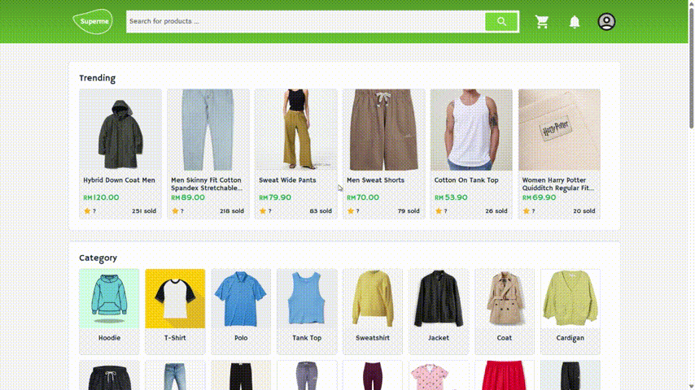
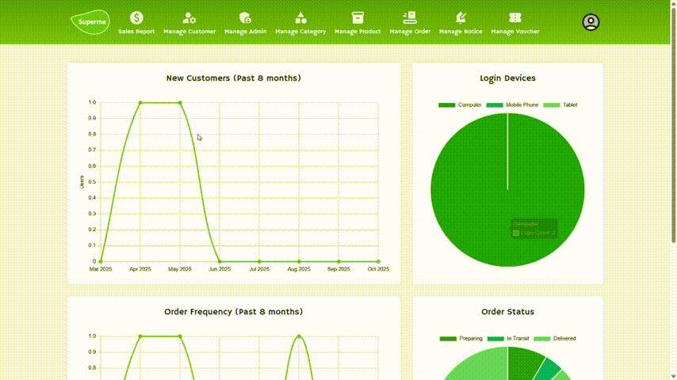
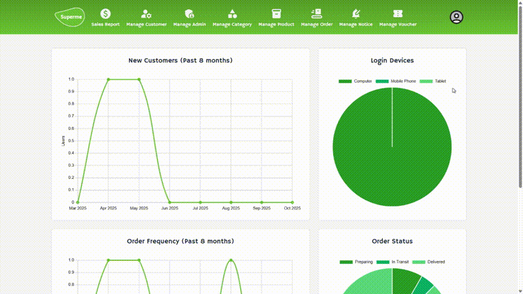

# 🛍️ E-Commerce System

A PHP-based e-commerce system that provides an end-to-end online shopping experience — from browsing products and managing carts to admin control and voucher redemption.

---

## 🚀 Features

### 👤 User Side
-   **Account System** — registration, login, and editable user profile.
-   **Product Browsing** — view products by category and details page.
-   **Shopping Cart** — add, update, or remove items dynamically.
-   **Order Management** — place orders and track status.
-   **Voucher & Notice System** — claim vouchers and view important updates.

### 🛠️ Admin Side
-   **Product Management** — add, edit, or delete product listings.
-   **Order Management** — review, update, or cancel user orders.
-   **User Management** — view and manage registered users.
-   **Voucher Management** — create or update vouchers and announcements.

---

## 🎥 Project Demonstration

### 🔐 Login & Profile

### 🛒 Orders

### ⚙️ Admin Management

### 🎁 Voucher, Notice & Redemption

